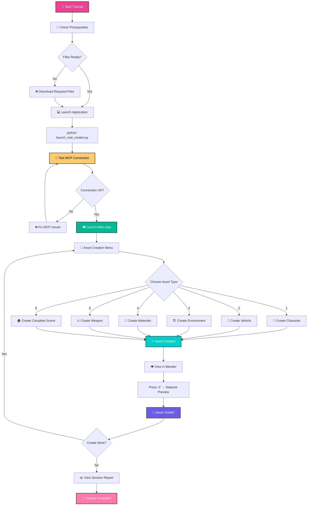
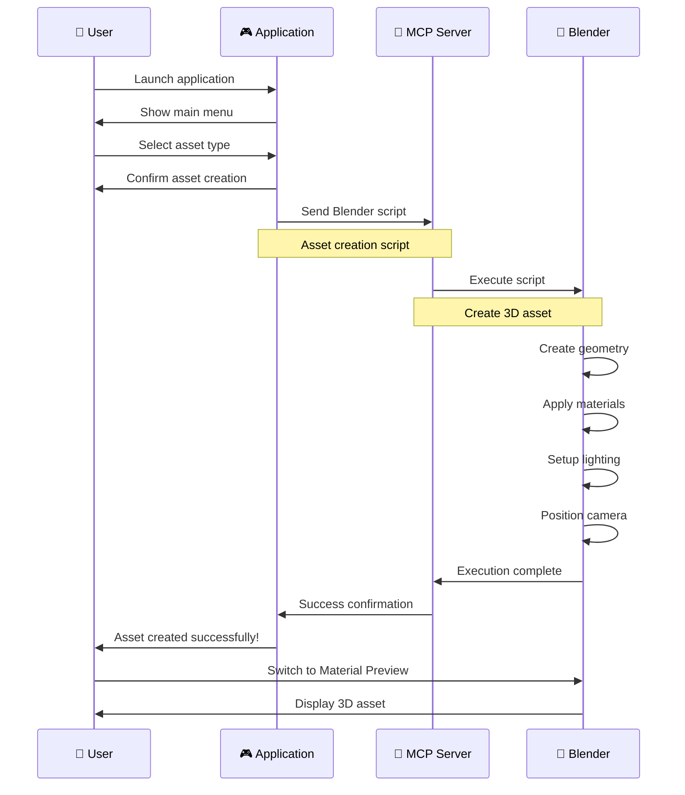
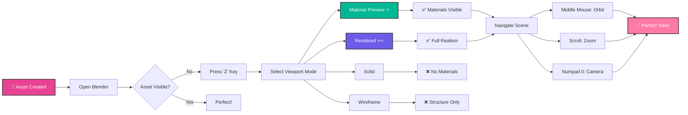
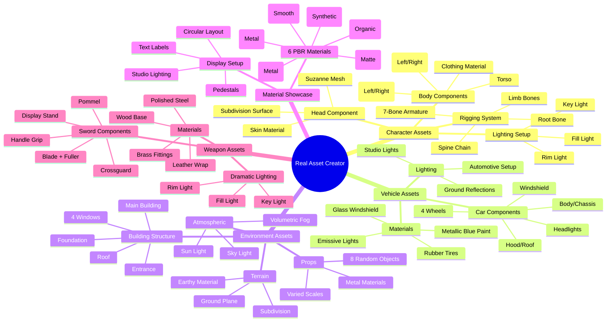
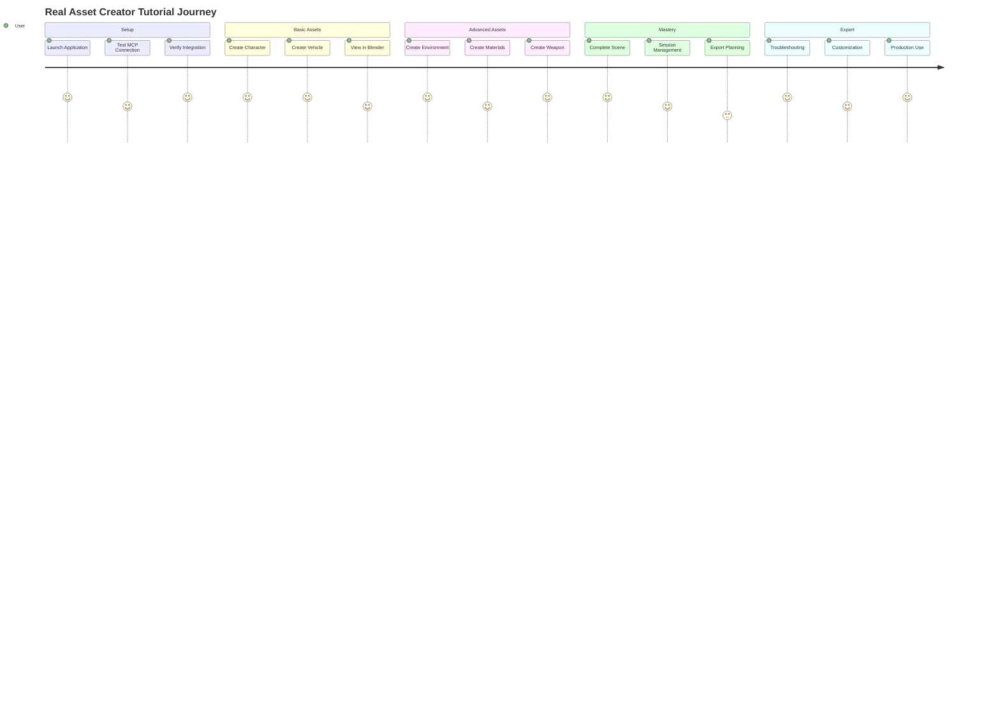
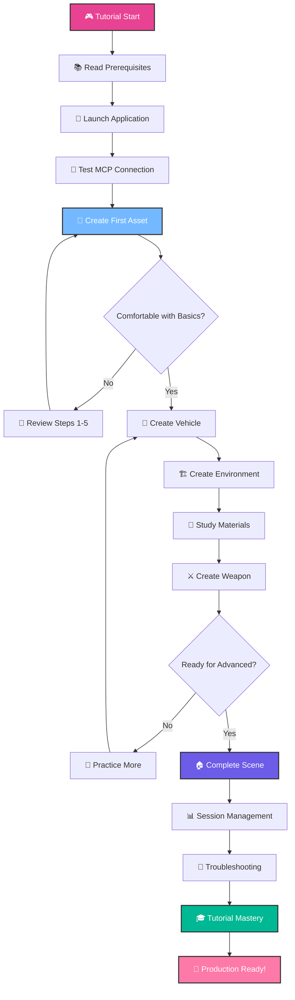
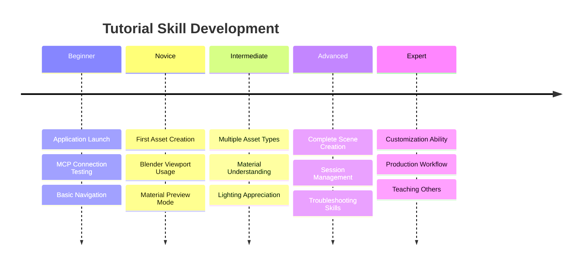

# 🎮 Real Asset Creator - Visual Workflow Tutorial

## 📊 **Complete Application Workflow**



## 🎯 **Asset Creation Workflow**



## 👁️ **Blender Viewing Workflow**



## 🎨 **Asset Types and Components**



## 📊 **Tutorial Progress Tracking**



## 🔧 **Troubleshooting Decision Tree**

```mermaid
flowchart TD
    A[❌ Problem Encountered] --> B{What's Wrong?}
    
    B -->|Can't see asset| C[Asset Visibility Issue]
    B -->|Materials look wrong| D[Material Display Issue]
    B -->|MCP connection failed| E[Connection Issue]
    B -->|Blender running slow| F[Performance Issue]
    
    C --> C1[Press 'Z' key]
    C1 --> C2[Select Material Preview]
    C2 --> C3[✅ Asset Visible]
    
    D --> D1[Switch to Rendered mode]
    D1 --> D2[Enable Screen Space Reflections]
    D2 --> D3[✅ Materials Correct]
    
    E --> E1[Check MCP Server Running]
    E1 --> E2[Test Connection (Option 2)]
    E2 --> E3[Restart if Needed]
    E3 --> E4[✅ Connection Fixed]
    
    F --> F1[Use Material Preview]
    F1 --> F2[Reduce Viewport Samples]
    F2 --> F3[Close Unused Scenes]
    F3 --> F4[✅ Performance Improved]
    
    style A fill:#e17055,stroke:#333,stroke-width:2px,color:#fff
    style C3 fill:#00b894,stroke:#333,stroke-width:2px,color:#fff
    style D3 fill:#00b894,stroke:#333,stroke-width:2px,color:#fff
    style E4 fill:#00b894,stroke:#333,stroke-width:2px,color:#fff
    style F4 fill:#00b894,stroke:#333,stroke-width:2px,color:#fff
```

## 🎯 **Learning Path Progression**



## 📈 **Skill Development Timeline**



---

## 🎯 **Quick Navigation**

- **📚 Full Tutorial**: `STEP_BY_STEP_TUTORIAL.md`
- **⚡ Quick Reference**: `QUICK_REFERENCE.md`
- **🔧 Integration Guide**: `REAL_ASSET_INTEGRATION_GUIDE.md`
- **📊 Application Summary**: `REAL_ASSET_CREATOR_SUMMARY.md`

**🎮 Ready to start your asset creation journey? Follow the visual workflow above! ✨**
